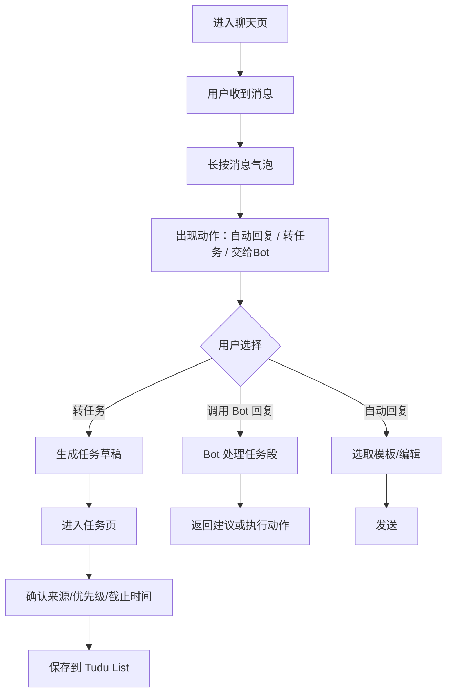
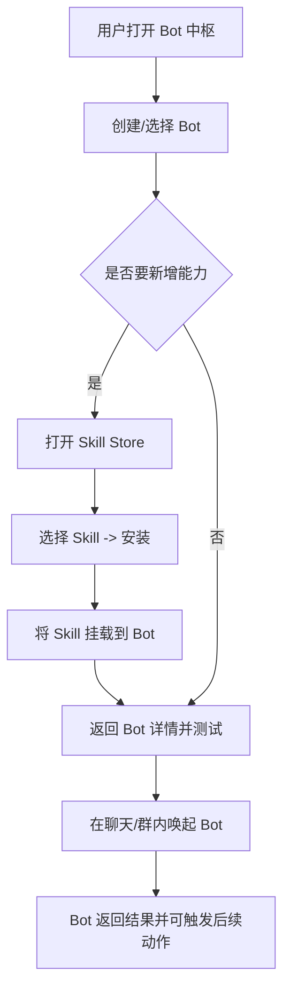
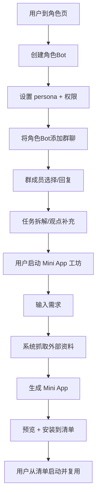

# 视频功能提炼（原始素材）

## 1. 文件来源
- 视频：`design/Videos2026-02-17_164456_386.mp4`
- 语音转写文本：`design/Videos2026-02-17_164456_386_transcript.txt`
- SRT：`design/Videos2026-02-17_164456_386_transcript.srt`
- 关键帧（30秒采样）：`design/keyframes/keyframe_0.jpg` 到 `design/keyframes/keyframe_13.jpg`
- 关键帧（场景变化点）：`design/keyframes/scene_points/*.jpg`

## 3. 功能总结（按模块）

### 3.1 实时聊天协作（微信型核心区）
- 私聊/群聊结构化对话（含“真人 + Bot”混合模式）
- 每条消息可一键触发“自动回复”
- 目标场景：行车中、开会中等免打字场景

### 3.2 消息转任务（Tudu/Todo）
- 聊天内容一键识别为任务项
- 点击任务词条即写入清单（Todo）
- 面向任务驱动的日常工作流（可持续追踪）

### 3.3 Bot / Skill 生态（你自己的 AI 助理）
- 支持创建/连接 Bot（你自己可管理的 AI 代理）
- 支持从 Skill Store 安装 Skill（应用增强能力）
- 可上传文档/Markdown 定义新 Skill
- Bot 可声明可执行能力（如“拆解专家”“代码助手”）
- 支持与 Bot 对话并调用能力完成具体操作

### 3.4 角色 Bot（人格化 Agent）
- 可按角色描述创建专属 Bot（如 Steve Jobs 角色等）
- 不同角色可被添加到群，支持“多角色协同讨论”
- 也可与真人混合加入群聊协作
- 适合运营、技术、店主等多岗位工作场景

### 3.5 Mini App（应用工坊）
- 通过需求对话生成 mini app
- 可检索/抓取外部资源（如 GitHub）构建组件或脚本包
- 生成后可安装并加入 app 清单
- 可持续创建并复用多个小应用（如打卡类等）

## 4. 关键帧清单（场景变化点）

以下图片均已从视频抽帧，建议作为 UI 原型参考截图。

- `design/keyframes/scene_points/scene_001_t0000.jpg`
- `design/keyframes/scene_points/scene_002_t0076.jpg`
- `design/keyframes/scene_points/scene_003_t0129.jpg`
- `design/keyframes/scene_points/scene_004_t0130.jpg`
- `design/keyframes/scene_points/scene_005_t0329.jpg`
- `design/keyframes/scene_points/scene_006_t0341.jpg`
- `design/keyframes/scene_points/scene_007_t0349.jpg`
- `design/keyframes/scene_points/scene_008_t0355.jpg`
- `design/keyframes/scene_points/scene_009_t0374.jpg`
- `design/keyframes/scene_points/scene_010_t0375.jpg`
- `design/keyframes/scene_points/scene_011_t0376.jpg`
- `design/keyframes/scene_points/scene_012_t0378.jpg`
- `design/keyframes/scene_points/scene_013_t0379.jpg`

## 5. 基于关键画面的 UI 定义（高层草图）

### 5.1 全局框架（移动端）
- 底部主导航（示例）：
  - 首页/聊天
  - Bot 中枢
  - 群与角色
  - Mini App 商店
  - 我的

### 5.2 模块页面结构

#### A. 聊天主界面
- 上方：搜索 + 未读/会话入口
- 中部：会话列表（私聊、群聊、群组）
- 下部：消息输入区
  - 文本输入
  - 自动回复快捷区（模板）
  - 一键发送 / 语音替代方案
- 右键/长按动作：
  - 标注为任务
  - 发送自动回复
  - 转发给 Bot 处理

#### B. 任务（Tudu List）
- 卡片列表（状态、优先级、截止时间）
- 来源标记（来源于群聊哪个消息）
- 一键收起 / 完成 / 追踪
- 与聊天可来回跳转（点击聊天片段自动高亮来源）

#### C. Bot 与 Skill 中心
- 分两列（或 Tab）：
  - 我的 Bot（已启用）
  - Skill 商店（可安装）
- Bot 详情页：能力清单 / 可调用技能 / 连接状态
- “新建 Bot”表单：角色提示词、权限边界、调用权限、知识来源
- Skill 接入页：安装、禁用、测试、回收

#### D. 角色群聊与协作
- 群组成员显示（真人 + Bot + 角色 Bot）
- “添加成员/角色”弹窗（可选是否可见系统行为）
- @提及入口（可指向具体角色）
- 对话区支持并行回复展示（角色不同颜色/标签）

#### E. Mini App 商店 / 工坊
- 搜索框 + 模版分类（代码助手、办公、打卡、数据类）
- “从对话创建 mini app”入口
- 生成进度条 + 结果预览
- “安装到清单”按钮
- 已安装清单 + 快速启动入口

### 5.3 关键交互流
1. 聊天识别场景：用户收到消息 -> 触发快速回复 -> 发送
2. 消息转任务：用户在消息气泡中点击“转任务” -> 创建任务项 -> 任务区可追踪
3. Bot 能力扩展：管理员选择 Skill Store -> 安装 Skill -> 在 Bot 详情页绑定到 Bot
4. 角色协作：创建角色 Bot -> 邀请到群 -> 与真人共处多角色对话
5. Mini App：输入需求 -> 自动生成 -> 预览 -> 安装 -> 应用清单使用

## 6. 风险与下一步建议

- 语音转写存在明显识别噪音（“买包/买bot/mybolt/Tudu”等）需人工校对
- 建议按上述模块产出 PRD 版需求：
  - 每个模块画出低保真线框图（含状态、空态、报错态）
  - 对关键功能给出数据模型（会话、任务、Bot、技能、角色、Mini App）
  - 先从聊天+任务两大路径做 MVP，随后再逐步接入 Skill/角色/Mini App

## 4.2 场景关键帧时间轴（结合转写时间点）

以下为基于 `select='gt(scene,0.30)'` 的场景关键点提取结果，对应 `design/keyframes/scene_points/` 文件名。

- t=00:00:00（scene_001_t0000）
  - 片头 / 进入主页，进入聊天主界面介绍段
- t=01:15（scene_002_t0076）
  - 切到群聊和自动回复示例区域
- t=02:08（scene_003_t0129）
  - 消息转任务（Tutu/Todo）交互说明
- t=02:10（scene_004_t0130）
  - 继续补充任务功能与入口说明
- t=05:29（scene_005_t0329）
  - 进入 Bot/Skill 创建与安装流程
- t=05:41（scene_006_t0341）
  - Skill Store 与 Bot 能力列表展开
- t=05:48（scene_007_t0349）
  - “你自己的 Bot”能力说明
- t=05:55（scene_008_t0355）
  - 自定义角色 Bot（如 Steve Jobs）提示词配置
- t=06:13（scene_009_t0374）
  - 角色 Bot 加入群聊
- t=06:15（scene_010_t0375）
  - 与多角色共聊、并行回复
- t=06:16（scene_011_t0376）
  - 角色视角差异与任务拆解协作
- t=06:17（scene_012_t0378）
  - Mini app 创建说明、代码源抓取
- t=06:19（scene_013_t0379）
  - Mini app 安装/任务闭环总结

## 7. 组件级 UI 规格（默认/空态/加载态/报错态）

### 页面：聊天页（主导航）
- 顶部
  - 标题：文本`string`，默认：`我的协作`
  - 搜索入口：输入框
    - 默认态：灰字“搜索联系人/群组/消息”
    - 空态：清空按钮隐藏，右侧按钮置灰
    - 输入中：显示清空 Icon
    - 报错态：无（客户端可复用全局提示）
- 会话列表项（组件）
  - 字段：`avatarUrl`, `name`, `subTitle`, `unreadCount`, `lastAt`, `tag`
  - 默认态：显示头像+名称+摘要+时间+未读红点
  - 空态：占位文案“暂无聊天，点击下方按钮发起会话”
  - 加载态：骨架屏（头像条 + 文本条）
  - 报错态：红色提示条“会话列表加载失败，请重试”+重试按钮
- 消息气泡组件
  - 字段：`senderType`, `avatar`, `text`, `time`, `autoReplyHint`
  - 默认态：右侧用户气泡/左侧他人气泡
  - 空态：无气泡，仅显示系统占位
  - 报错态：发送失败时显示重发按钮
- 底部输入区
  - 字段：`inputText`, `quickReplyTokens`, `sendEnabled`, `isVoiceMode`
  - 默认态：输入框空，自动回复词条显示在可滑区域
  - 空态：无输入时 `发送`置灰
  - 加载态：发送中转圈（或禁用）
  - 报错态：提示“消息发送失败”+一键重发

### 页面：任务清单页（Todo）
- 任务卡片
  - 字段：`title`, `dueAt`, `source`（来源消息 id）、`status`, `priority`, `owner`
  - 默认态：展示全部字段并可展开折叠
  - 空态：空卡片文案“从聊天里选中内容可创建任务”
  - 加载态：每行卡片骨架占位
  - 报错态：更新失败提示 + 重试
- 顶部筛选
  - 字段：`statusFilter`, `sortBy`
  - 默认：`全部` + `最新`
  - 空态：筛选控件保留，但禁用操作
  - 报错态：网络异常时禁用筛选

### 页面：Bot 与 Skill 中心
- Bot 列表卡片
  - 字段：`botName`, `avatar`, `description`, `status`, `capabilities[]`
  - 默认态：显示状态为「在线/离线」和能力标签
  - 空态：文案“未安装 Bot，去 Skill 商店创建”
  - 加载态：列表骨架
  - 报错态：提示“获取 Bot 失败”
- Skill 详情页
  - 字段：`name`, `logo`, `type`, `permissionScope`, `installState`, `version`
  - 默认态：展示详情 + 安装/移除按钮
  - 空态：返回“该 Skill 暂无数据”
  - 报错态：安装失败理由 + 重试
- 创建 Bot 抽屉
  - 字段：`botName`, `rolePrompt`, `persona`, `tools[]`, `safetyLevel`
  - 默认态：输入可用，`创建`按钮可用
  - 空态：引导字段校验红色提示
  - 加载态：提交后按钮转转圈且禁用
  - 报错态：字段级提示 + 全局 error banner

### 页面：角色与群协作
- 成员卡（群成员）
  - 字段：`memberType`（真人/机器人/角色Bot）、`name`、`status`
  - 默认态：颜色标签区分成员类型
  - 空态：空群提示+添加入口
  - 报错态：邀请失败提示
- “添加成员”弹窗
  - 字段：`searchKeyword`, `selectedMembers[]`, `inviteType`
  - 默认态：支持搜索 + 勾选
  - 空态：无结果显示空态文案
  - 加载态：搜索骨架
  - 报错态：邀请失败文案

### 页面：Mini App 工坊
- 创建面板
  - 字段：`query`, `sources[]`（GitHub / Tagcrunch / 本地知识）、`generateState`
  - 默认态：输入框 + 开始生成
  - 空态：输入为空时按钮禁用
  - 加载态：进度条（0~100），并显示阶段标签
  - 报错态：生成失败原因 + 重试按钮
- 清单页卡片
  - 字段：`appName`, `icon`, `summary`, `status`, `installAction`
  - 默认态：可直接安装
  - 空态：暂无应用时引导“从对话生成第一款”
  - 报错态：安装失败+重试

## 8. 页面级用户流程图（Mermaid）

### 流程 A：聊天场景下的消息即任务

### 流程 B：Bot & Skill 赋能闭环

### 流程 C：角色 Bot + Mini App 生成到复用

## 9. 设计师组件清单（字段级）

### 组件库建议（命名）
- `TopBar`：`title`, `onSearch`, `onMore`
- `SearchInput`：`value`, `placeholder`, `onChange`, `onClear`
- `ConversationList`：`items[]`, `onOpenChat`, `onSearchResult`
- `ConversationItem`：`avatar`, `name`, `lastMessage`, `time`, `unread`, `badgeType`
- `MessageBubble`：`role`, `content`, `createdAt`, `status`, `actions`
- `AutoReplySheet`：`templates[]`, `onUse`, `onEdit`
- `TodoCard`：`title`, `dueAt`, `sourceRef`, `status`, `priority`, `onComplete`, `onOpenSource`
- `TodoFilters`：`status`, `priority`, `sort`, `onChange`
- `BotCard`：`bot`, `capabilities`, `status`, `onOpen`, `onToggle`
- `SkillCard`：`skill`, `permission`, `installed`, `onInstall`, `onUninstall`, `onOpen`
- `CreateBotDrawer`：`mode`, `initialValues`, `onSubmit`, `onValidate`
- `RolePill`：`label`, `type`, `color`
- `MemberPickerModal`：`groupMembers`, `candidateList`, `onInvite`, `onRemove`
- `MiniAppCard`：`icon`, `name`, `desc`, `state`, `onGenerate`, `onInstall`, `onOpen`
- `ProgressStepper`：`steps[]`, `currentStep`, `onRetry`
- `StateBanner`：`type`（success/error/info）, `text`, `actionText`, `onAction`

### 全局原子组件
- `EmptyState`：`title`, `desc`, `image`, `primaryAction`
- `ErrorState`：`code`, `message`, `primaryAction`, `secondaryAction`
- `LoadingSkeleton`：`rows`, `density`
- `ConfirmDialog`：`title`, `content`, `okText`, `cancelText`, `onConfirm`
- `Tag`：`text`, `tone`, `dot`

## 10. 产出建议（下一版可直接交付）
- 先按 `聊天页` + `任务清单` 做一版低保真稿（低风险、先跑通核心）
- 再补 `Bot/SKILL` 与 `Mini App` 两页（含空态）
- 最后补 `群与角色` 的协同细节（颜色编码、优先级与回复归属）
- 全部页面统一接入同一类状态组件（`LoadingSkeleton`、`EmptyState`、`ErrorState`）
